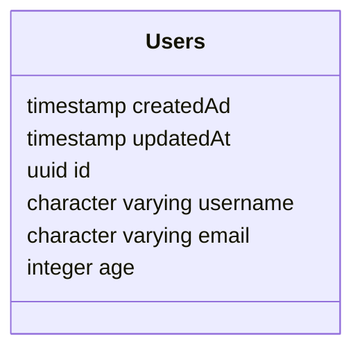
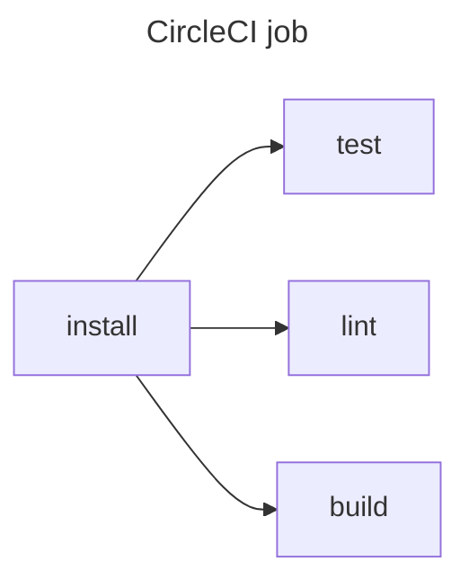

# Your Awesome Project name

A quick but kickass description of the purpose of this repository

## Table of Contents

- [Installation](#installation)
    - [Minimum requirements](#minimum-requirements)
    - [Install the application locally](#install-the-application-locally)
- [Development](#development)
    - [Coding conventions](#coding-conventions)
    - [Swagger and Validation Pipes](#swagger-and-validation-pipes)
- [Architectures](#architectures)
    - [Structure](#structure)
    - [Framework](#framework)
    - [Database](#database)
    - [Data model](#data-model)
- [Infrastructure](#infrastructure)
  - [Entrypoint and Dependency Injection](#entrypoint-and-dependency-injection)
  - [Configuration](#configuration)
  - [Endpoints and Services](#endpoints-and-services)
- [Testing strategy](#testing-strategy)
  - [Commands](#commands)
  - [Test Structure](#test-structure)
- [Continuous Integration](#continuous-integration)

## Installation

### Minimum requirements

List of requirement with **exact** versions and install documentation link. Example:

- [NodeJS](https://nodejs.org/en/) 12.15.0 (You can use [nvm](https://github.com/nvm-sh/nvm))
- [Yarn](https://classic.yarnpkg.com/en/docs/install) 1.22.0
- [Docker](https://docs.docker.com/install/) 19.03.8
- [Docker Compose](https://docs.docker.com/compose/install/) 1.25.4

### Install the application locally

List of command to run to have to project running locally. Example:

- Run `git clone git@github.com:your-organisation/symeo-js-template.git` or `git clone https://github.com/your-organisation/symeo-js-template.git` to clone the repository
- Run `cd symeo-js-template` to navigate to the code folder
- Run `yarn` to install node dependencies
- Run `docker-compose up` to start the local PostGreSQL Database
- Run `cp .env.example .env.development` to copy the example dot env file
- Edit the created `.env.development` file with the relevant variable values
- Run `yarn start:dev` to start the application on the 9999 port

## Development

### Coding conventions

The coding conventions and style are enforced by the [eslint](https://eslint.org/) linter and the [prettier](https://prettier.io/) formatter. The configuration can be found in the [.eslintrc.js](./.eslintrc.js) file and the [.prettierrc](./.prettierrc) file. Your IDE should be configured to use those configurations.

To check linting error in command line, run `yarn lint`.

To fix automatically format errors, run `yarn format`.

We use [swagger](https://swagger.io/) to create documentation of our API
See the section below to understand how to configure swagger in NestJS.
- Launch the application with `yarn start:dev` and then go to your browser and type `http://localhost:9999/openapi` to see the documentation of the API.

### Swagger and Validation Pipes

#### Swagger

The configuration of swagger is made in the `src/main.ts` file:

```typescript
const swaggerConfig = new DocumentBuilder()
    .setTitle('Symeo JS Template')
    .setVersion('1.0')
    .build();
  const swaggerDocument = SwaggerModule.createDocument(app, swaggerConfig);
  SwaggerModule.setup('openapi', app, swaggerDocument);
```

Then you can add `annotations` to your endpoints, DTOs, etc... in order to build your documentation.
[See the documentation](https://docs.nestjs.com/openapi/introduction).

#### Validation Pipes

Thanks to [validation pipes](https://docs.nestjs.com/techniques/validation), your DTOs will have strong typing consistency:

```typescript
@ApiProperty()  // <-- Swagger 
@IsNotEmpty()   // <-- Validation pipe
@IsUUID()       // <-- Validation pipe
id: string;

@ApiProperty()
@IsNotEmpty()
@IsString()
username: string;
```

## Architectures

### Structure

The source code is contained in the `/src` directory:

```shell
src
├── application
│   ├── controller
│   │   ├── hello-world.controller.ts
│   │   └── user.controller.ts
│   ├── decorator
│   └── dto
│       └── user
│           ├── create-user.dto.ts
│           ├── create-user.response.dto.ts
│           ├── get-user.response.dto.ts
│           └── user.dto.ts
├── bootstrap
│   ├── application.module.ts
│   ├── domain.module.ts
│   └── postgres.adapter.module.ts
├── config
│   └── configuration.ts
├── domain
│   ├── model
│   │   └── user.model.ts
│   ├── port
│   │   ├── in
│   │   │   └── user.facade.ts
│   │   └── out
│   │       └── user.storage.port.ts
│   └── service
│       └── user.service.ts
├── infrastructure
│   └── postgres-adapter
│       ├── adapter
│       │   └── postgres.user.adapter.ts
│       ├── entity
│       │   ├── abstract.entity.ts
│       │   └── user.entity.ts
│       ├── migrations
│       │   └── 1683279035563-createUsers.ts
│       └── ormconfig.ts
└── main.ts
```

The structure of this project follows **Hexagonal-Architecture** and **Domain-Driven-Design** principles and is seperated into 4 main folders:
1. `/application`: it will contain all the route endpoints (`/application/controller`) as well as the DTOs of those endpoints (`/application/dto`).
2. `/domain`: this is where all the business logic has to be. You will find the `models`, the different ports `/domain/port/in` and `/domain/port/out` on which you will plug your adapters and finally your `services`.
3. `/infrastructure`: this is where all your adapters should be. For now, you will only find one adapter which is a `postgres-adapter`.
4. `/bootstrap`: this is where you will bootstrap your project by making [dependency injections](#entrypoint and dependency injection).

### Framework

The framework used for this project is NestJS. NestJS is used to build Node.js server-side application. It fully supports Typescript (even if you still can write code in pure Javascript). 
This project is written in Typescript.

NestJS uses Express as a framework for HTTP servers by default. However, you can configure it to use Fastify instead.
It also uses [modules](https://docs.nestjs.com/modules) to organise the structure of a project.

:page_facing_up: You can find the official documentation of NestJS [here](https://docs.nestjs.com/).

### Database

#### PostgreSQL and TypeORM

In this project, you will find a simple postgresSQL database configured with Docker as well as [TypeORM](https://typeorm.io/) for your ORM.

- To configure TypeORM (as all the modules) you first need to import the `TypeOrmModule` inside of the Postgres Module (see `postgres.adapter.module.ts` file).
- Then we create the `ormconfig.ts` file in the `postgres-adapter`.

```typescript
export function ormConfig(
  configService: ConfigService,
): PostgresConnectionOptions {
  return {
    type: 'postgres',
    host: configService.get<string>('database.typeorm.host'),
    port: configService.get<number>('database.typeorm.port'),
    username: configService.get<string>('database.typeorm.username'),
    password: configService.get<string>('database.typeorm.password'),
    database: configService.get<string>('database.typeorm.database'),
    migrations: [join(__dirname, 'migrations/*.js')],
    synchronize: configService.get<boolean>('database.typeorm.synchronize'),
    migrationsRun: configService.get<boolean>('database.typeorm.migrationsRun'),
  };
}
```

We use configuration values to create this file, you can follow the NestJS official documentation for configuration [here](https://docs.nestjs.com/techniques/configuration#custom-configuration-files).

#### Migrations

To create a migration, you can use the following command:

```shell
yarn migration:create <path_to_the_migrations_directory>
```

An example of migration is provided in this project and can be found at `/src/infrastructure/postgres-adapter/migrations`. In this directory, you will find a file as follows:

```typescript
import { MigrationInterface, QueryRunner } from 'typeorm';

export class createUsers1683279035563 implements MigrationInterface {
  name = 'createUsers1683279035563';

  public async up(queryRunner: QueryRunner): Promise<void> {
    await queryRunner.query(`CREATE TABLE "users"
                                 (
                                     "createdAt" TIMESTAMP WITH TIME ZONE NOT NULL DEFAULT now(),
                                     "updatedAt" TIMESTAMP WITH TIME ZONE NOT NULL DEFAULT now(),
                                     "id"        uuid                     NOT NULL DEFAULT uuid_generate_v4(),
                                     "username"  character varying        NOT NULL,
                                     "age"       integer                  NOT NULL,
                                     "email"     character varying        NOT NULL,
                                     CONSTRAINT "PK_user_id" PRIMARY KEY ("id")
                                 )`);
  }

  public async down(queryRunner: QueryRunner): Promise<void> {
    await queryRunner.query(`DROP TABLE "users"`);
  }
}
```

### Data model

For now, only one table (users) is present as an example in the project.




## Infrastructure

### Entrypoint and Dependency Injection

The entrypoint of your application is the `main.ts` file located at `/src/main.ts`.
NestJS works with modules (see [here](https://docs.nestjs.com/modules)), consequently, the first think your application will need to do is import the main module.

```typescript
// src/main.ts
const app = await NestFactory.create(ApplicationModule);
```

Your `/src/bootstrap` folder will have the same structure as your application. One module for the application folder, one for the domain and one for each adapter you'll need to plug.

In NestJS, you'll do your dependency injections as follows:

```typescript
// src/bootstrap/domain.module.ts
const UserFacadeProvider = {
    provide: 'UserFacade',
    useFactory: (userStoragePort: UserStoragePort) =>
        new UserService(userStoragePort),
    inject: ['PostgresUserAdapter'],
};
@Module({
    imports: [PostgresAdapterModule],
    providers: [UserFacadeProvider],
    exports: [UserFacadeProvider],
})
export class DomainModule {}
```

### Configuration

In this project, we use `.env.*` files to manage configuration variables and secrets. You can find the official documentation of how NestJS handle configurations [here](https://docs.nestjs.com/techniques/configuration#configuration).

- Run the application using development configuration values by running `yarn start:dev`
- Run the application using production configuration values by running `yarn start:prod`

### Endpoints and Services

As examples in this project, 3 endpoints can be accessed:

- `(GET) /hello-world` : display a simple "Hello World" message.
- `(GET) /users/:id` : get a user by its id.
- `(POST) /users` : create a user.

> See the section about swagger [here](#swagger) to have a better understanding of those endpoints and the data required.

## Testing strategy

The tests are carried out using the [jest](https://jestjs.io/) library.

Faker values are generated with the [fakerjs](https://fakerjs.dev/) library.

Interface mocking are made thanks to the [ts-mockito](https://www.npmjs.com/package/ts-mockito) library.

### Commands

- Use `yarn test` to launch all tests.
- Use `yarn test:cov` to launch all tests and get coverage report.

### Test Structure

#### Unit Tests

You will find an example of unit tests in `/tests/unit/domain/service` used to test behavior of the example service `user.service.ts`.

In those tests, we do not reach external dependencies. Therefore, we must mock things like database access, external api access, etc...   

#### Integration Tests

Those tests are located to `/tests/integration` and are here to test the global behavior of our API. We must fake a start of our application and this is done
by the `app.client.ts` file located in `/tests/utils/`.

The folder `/tests/utils` is also the place where we will put code that allows us to fake the presence of entities in database, external APIs, etc...

## Continuous Integration

A configuration for [circleci](https://circleci.com/) is already present in this project at `.circleci/config.yml`.

Only one job is present in it and the steps of this job are:

